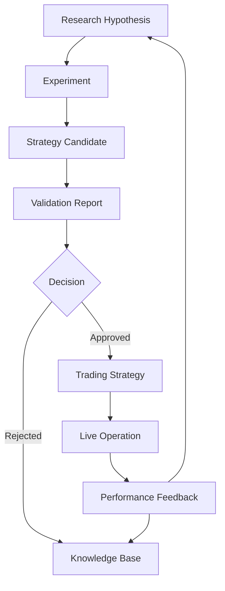
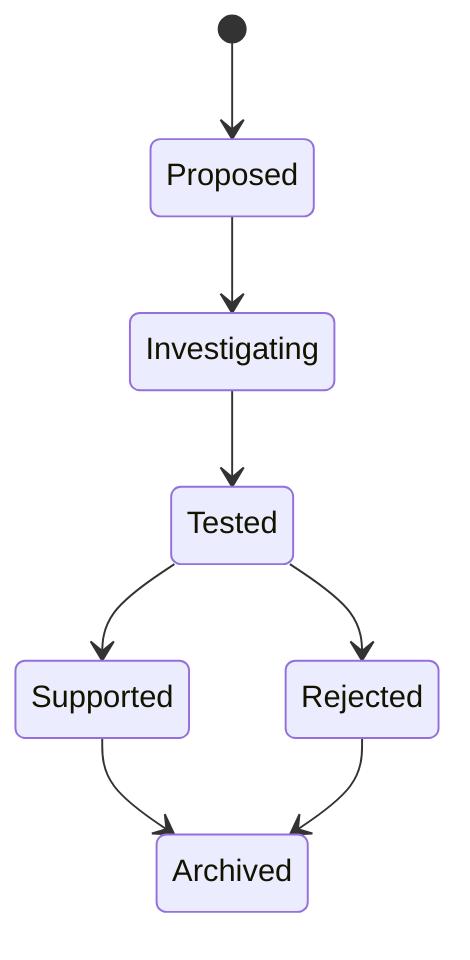
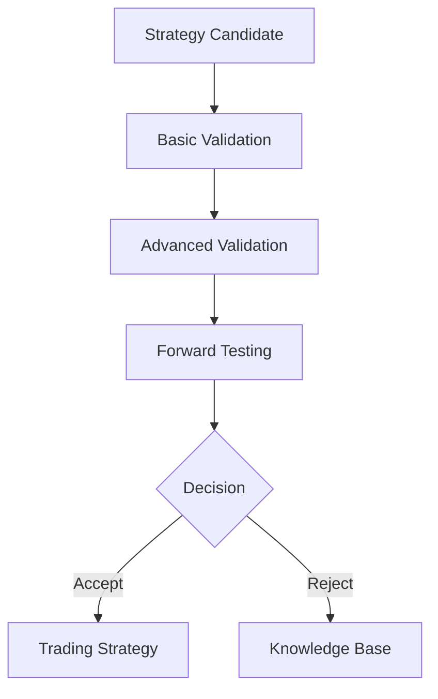
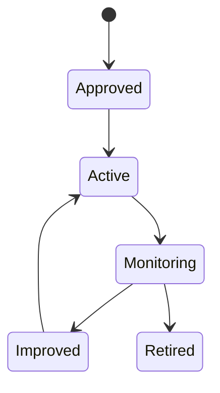
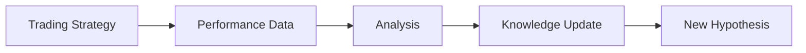
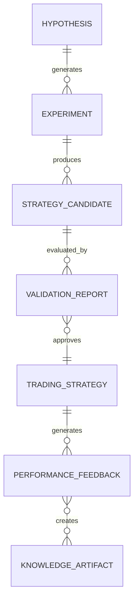
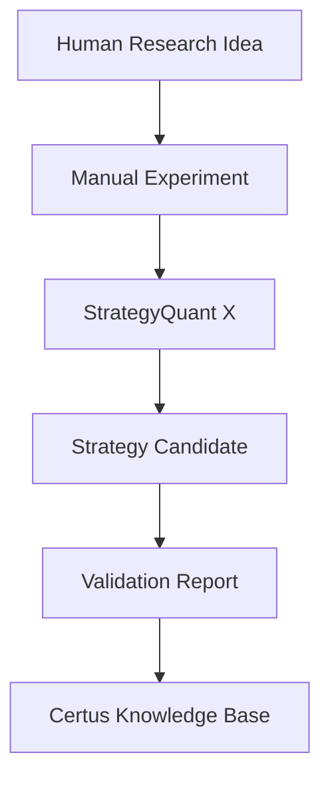

# Certus Domain Model

## Purpose

This document defines the core domain concepts of Certus.

The purpose of this model is to establish a shared language between:

- human researchers
- AI agents
- software components
- future development teams

The domain model describes how quantitative research knowledge flows
through Certus, from an initial idea to validated strategy operation.

This document focuses on concepts and relationships, not implementation
details.

---

# Domain Overview

Certus manages the lifecycle of quantitative research:



---

# Core Domain Entities

---

# 1. Research Hypothesis

## Definition

A Research Hypothesis represents a quantitative idea or assumption that
requires investigation.

A hypothesis is not a strategy.

It is a statement about a possible relationship, behavior, or opportunity
in financial markets.

## Example

```
Hypothesis:

"Mean reversion strategies perform better during low-volatility market
regimes."
```

## Attributes

A hypothesis should contain:

- statement
- motivation
- assumptions
- market context
- expected behavior
- related research

## Lifecycle



---

# 2. Experiment

## Definition

An Experiment is a controlled attempt to test a hypothesis.

An experiment defines:

- what is being tested
- how it is tested
- what data is used
- what parameters are applied
- what results are produced

## Example

```
Hypothesis:

Mean reversion works better in low volatility.

Experiment:

Test RSI-based mean reversion on AUDCAD H1 data
between 2015-2025.
```

## Attributes

An experiment includes:

- hypothesis reference
- dataset
- timeframe
- market
- methodology
- parameters
- tools used
- results

## Principles

Experiments must be:

- reproducible
- traceable
- comparable

---

# 3. Strategy Candidate

## Definition

A Strategy Candidate is a potential trading strategy produced from an
experiment.

A candidate is not yet considered a valid strategy.

It represents an option requiring further evaluation.

## Why This Exists

A successful backtest does not automatically create a strategy.

The candidate must survive validation.

## Attributes

- entry rules
- exit rules
- position sizing logic
- market assumptions
- originating hypothesis
- experiment history

---

# 4. Validation Report

## Definition

A Validation Report contains the evidence used to evaluate a Strategy
Candidate.

The purpose of validation is to determine whether observed performance is
likely to represent a real opportunity rather than noise or overfitting.

## Validation Areas

Possible validation dimensions:

- in-sample performance
- out-of-sample performance
- walk-forward analysis
- robustness testing
- risk analysis
- transaction cost impact
- market regime analysis

## Example Decision Flow



---

# 5. Trading Strategy

## Definition

A Trading Strategy is a validated and approved strategy that is eligible
for operational use.

A strategy represents more than trading rules.

It includes:

- evidence
- validation history
- risk characteristics
- limitations
- operational requirements

## Lifecycle



---

# 6. Live Operation

## Definition

Live Operation represents the execution of an approved strategy in a real
market environment.

Initial phases may include:

- manual execution
- paper trading
- broker-assisted execution

Future phases may include:

- automated execution
- execution agents
- portfolio management

## Responsibilities

- execution tracking
- operational monitoring
- performance collection
- incident recording

---

# 7. Performance Feedback

## Definition

Performance Feedback connects real-world outcomes back into the research
process.

This creates the closed-loop learning capability of Certus.

## Feedback Sources

Examples:

- realized returns
- drawdowns
- execution differences
- market changes
- strategy degradation

## Flow



---

# 8. Knowledge Artifact

## Definition

A Knowledge Artifact is any documented piece of quantitative knowledge
generated during the research lifecycle.

Examples:

- hypothesis
- experiment result
- failed strategy
- validation report
- market observation
- execution analysis

## Principle

Knowledge is not stored as absolute truth.

Each artifact must preserve:

- context
- assumptions
- evidence
- confidence
- time validity

---

# Relationships Between Entities



---

# Domain Boundaries

Certus separates three major domains:

## Research Domain

Responsible for:

- hypotheses
- experiments
- analysis
- knowledge creation

---

## Validation Domain

Responsible for:

- evidence evaluation
- robustness testing
- risk assessment
- approval decisions

---

## Operation Domain

Responsible for:

- execution
- monitoring
- performance feedback

---

# Initial MVP Domain Scope

The first implementation does not require all domains to be fully
automated.

Initial focus:



Human researchers remain responsible for:

- hypothesis creation
- strategy implementation
- final decisions

Certus initially focuses on:

- organization
- traceability
- knowledge management
- validation workflow

---

# Summary

Certus is designed around a simple principle:

> A trading strategy is not an idea that worked once.
> It is a continuously evaluated knowledge artifact that has survived
> a disciplined research lifecycle.