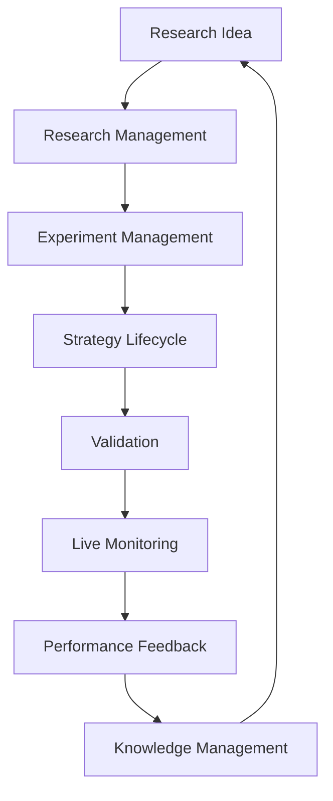
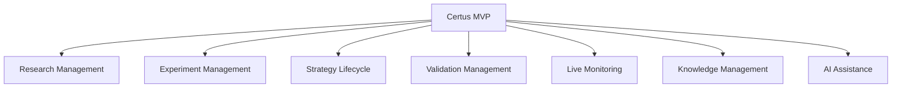

# Certus Feature Map

## Purpose

This document defines the feature landscape of the Certus MVP.

Features represent user-facing and system-level capabilities derived from:

- Product Vision
- Product Principles
- Domain Model
- MVP Scope

This document does not define implementation details.

Detailed requirements will be defined in individual feature specifications.

---

# Feature Organization

Certus MVP features are organized around the quantitative research and
operation lifecycle:



---

# Epic Overview



---

# Epic 1: Research Management

## Purpose

Provide a structured workspace for managing quantitative research.

## Related Capability

- CAP-001 Quantitative Research Management
- CAP-003 Hypothesis Generation and Management

---

## Feature 1.1: Create Research Project

### Description

Allow researchers to create and organize independent research initiatives.

### Example

```
AUDCAD Mean Reversion Research
```

### Priority

MVP Phase 1

---

## Feature 1.2: Manage Research Hypothesis

### Description

Allow researchers to define, update, and track quantitative hypotheses.

### Example

```
Mean reversion strategies perform better
during low volatility regimes.
```

### Priority

MVP Phase 1

---

## Feature 1.3: Manage Research Artifacts

### Description

Maintain relationships between research artifacts:

- hypotheses
- experiments
- reports
- strategies

### Priority

MVP Phase 1

---

# Epic 2: Experiment Management

## Purpose

Create reproducible and traceable quantitative experiments.

## Related Capability

- CAP-004 Experiment Management

---

## Feature 2.1: Create Experiment

### Description

Define an experiment based on a research hypothesis.

### Information

- hypothesis
- market
- timeframe
- dataset
- methodology
- parameters

### Priority

MVP Phase 1

---

## Feature 2.2: Store Experiment Evidence

### Description

Attach supporting evidence and experiment outputs.

Examples:

- backtest reports
- screenshots
- exported files
- metrics

### Priority

MVP Phase 1

---

## Feature 2.3: Compare Experiments

### Description

Allow comparison between different experiment results.

### Priority

MVP Phase 2

---

# Epic 3: Strategy Lifecycle

## Purpose

Manage the transition from research output to operational strategy.

## Related Capability

- CAP-006 Strategy Lifecycle Management

---

## Feature 3.1: Register Strategy Candidate

### Description

Create a strategy candidate from experiment results.

### Principle

A successful experiment does not automatically create a strategy.

### Priority

MVP Phase 2

---

## Feature 3.2: Promote Candidate to Strategy

### Description

Convert an approved strategy candidate into an operational strategy.

### Priority

MVP Phase 2

---

## Feature 3.3: Strategy Version Management

### Description

Maintain strategy evolution history.

Examples:

```
AUDCAD MR v1

AUDCAD MR v2
```

### Priority

Future

---

# Epic 4: Validation Management

## Purpose

Ensure strategies are evaluated through evidence-based processes.

## Related Capability

- CAP-005 Strategy Validation

---

## Feature 4.1: Create Validation Report

### Description

Record validation activities and results.

Includes:

- backtest results
- robustness checks
- observations
- conclusions

### Priority

MVP Phase 1

---

## Feature 4.2: Validation Decision

### Description

Record validation outcome.

Possible states:

```
Approved

Rejected

Needs More Evidence
```

### Priority

MVP Phase 2

---

# Epic 5: Live Monitoring

## Purpose

Connect validated strategies with real-world observation.

## Related Capability

- CAP-008 Execution and Feedback Loop

---

## Feature 5.1: Register Deployment Instance

### Description

Represent a deployed strategy instance.

Example:

```
Strategy:

AUDCAD MR v2


Deployment:

MT4 Demo Account
```

### Priority

MVP Phase 2

---

## Feature 5.2: MT4 Monitoring Adapter

### Description

Provide the first platform integration for live monitoring.

Responsibilities:

- collect trading status
- collect positions
- collect performance data

### Design Principle

MT4 is an adapter, not a platform dependency.

### Priority

MVP Phase 2

---

## Feature 5.3: Live Strategy Dashboard

### Description

Provide visibility into active strategies.

Display:

- positions
- equity
- drawdown
- performance metrics
- strategy status

### Priority

MVP Phase 2

---

## Feature 5.4: Execution Feedback Capture

### Description

Capture differences between expected and real-world behavior.

Examples:

- slippage
- execution issues
- performance deviation

### Priority

Future / MVP Extension

---

# Epic 6: Knowledge Management

## Purpose

Preserve and reuse quantitative knowledge.

## Related Capability

- CAP-009 Quantitative Knowledge Management

---

## Feature 6.1: Knowledge Artifact Repository

### Description

Store research knowledge artifacts.

Examples:

- failed experiments
- successful strategies
- validation reports

### Priority

MVP Phase 1

---

## Feature 6.2: Research Knowledge Search

### Description

Allow researchers to discover previous work.

Example:

```
Have we tested mean reversion
strategies on AUDCAD before?
```

### Priority

MVP Phase 3

---

# Epic 7: AI Assistance

## Purpose

Increase research productivity through AI assistance.

## Related Capability

- CAP-010 AI Agent Collaboration Framework

---

## Feature 7.1: Research Document Assistant

### Description

Assist with:

- hypothesis writing
- report generation
- summarization

### Priority

MVP Phase 3

---

## Feature 7.2: Knowledge Assistant

### Description

Enable natural language interaction with research knowledge.

Example:

```
What strategies failed because of overfitting?
```

### Priority

Future

---

# MVP Delivery Roadmap

## Phase 1: Research Foundation

Goal:

Build the research operating system.

Features:


---

## Phase 2: Strategy Operation

Goal:

Connect validated research with live observation.

Features:


---

## Phase 3: AI Augmentation

Goal:

Increase research efficiency.

Features:

- Research Assistant
- Knowledge Assistant
- Automated Analysis

---

# Feature Development Principles

Features must follow these principles:

## Traceability

Every feature must map to:

- capability
- domain concept
- user value

---

## Incremental Delivery

Features should deliver value independently.

---

## Human-in-the-loop

Automation should increase gradually.

---

## Artifact Driven Development

Each feature should produce and consume structured artifacts.

---

# Summary

The Certus MVP feature map defines the first building blocks of an
AI-native quantitative research organization.

The implementation path is:

```
Feature

   |

Specification

   |

Implementation

   |

Validation

   |

Knowledge Artifact
```

Each feature contributes to the long-term vision while remaining useful as
an independent capability.