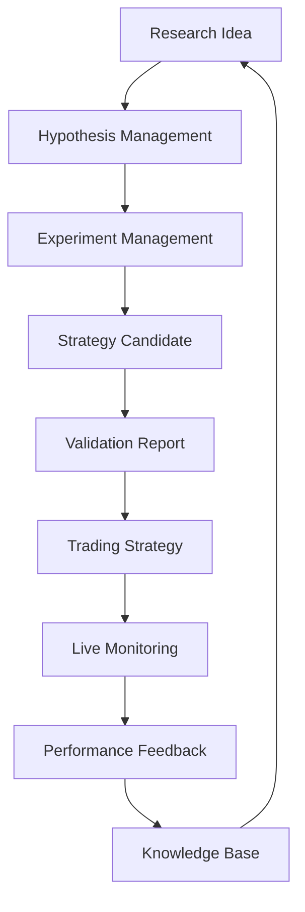
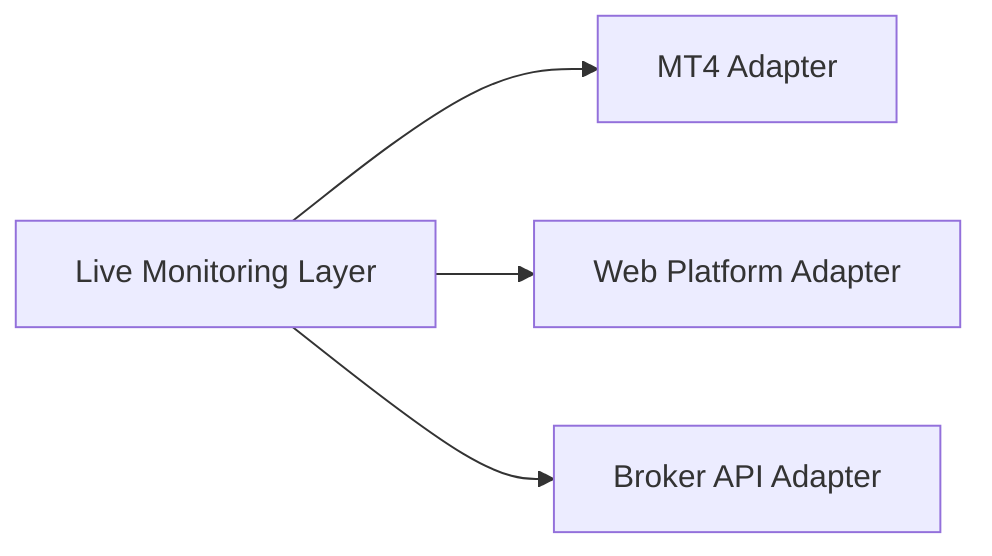

# Certus MVP Scope

## Purpose

This document defines the scope of the first implementation phase of
Certus.

The MVP is designed to validate the core assumption behind Certus:

> A structured, traceable, and knowledge-driven quantitative research
> process can significantly improve the ability of independent researchers
> to discover, evaluate, deploy, and improve trading strategies.

The MVP is not intended to build a fully autonomous trading organization.

It establishes the foundation required for future AI-assisted and
AI-autonomous capabilities.

---

# MVP Objective

The primary objective of the Certus MVP is to create a minimum viable
Quantitative Research and Operations System.

The system should enable a researcher to:

1. Capture a trading idea
2. Define a research hypothesis
3. Run controlled experiments
4. Evaluate strategy candidates
5. Deploy validated strategies
6. Monitor live behavior
7. Preserve quantitative knowledge

---

# MVP Philosophy

The MVP follows these principles:

## Human First

Humans remain responsible for:

- research decisions
- strategy implementation
- final validation decisions
- capital allocation decisions

Certus assists and organizes.

---

## Manual Before Automated

Processes that will eventually be delegated to AI agents are initially
performed manually.

This allows:

- understanding the workflow
- discovering real requirements
- avoiding premature automation

---

## Foundation Before Intelligence

The first goal is not creating autonomous agents.

The first goal is creating the environment where intelligent agents can
operate effectively in the future.

---

## Build Certus Using Certus Principles

The development process of Certus follows the same principles that Certus
will later enable:

- specification-driven development
- documented decisions
- traceable artifacts
- incremental evolution
- validation before expansion

Development practices include:

- Spec Kit methodology
- AI-assisted implementation with tools such as MiMo
- structured product artifacts

---

# MVP Scope Overview

Certus MVP consists of two connected loops:



---

# In Scope

# 1. Research Workspace

## Goal

Provide a structured environment for managing quantitative research.

## Capabilities

- Create research projects
- Organize research activities
- Track research status
- Link research artifacts

---

# 2. Hypothesis Management

## Goal

Convert informal trading ideas into explicit research questions.

## Capabilities

- Create hypotheses
- Define assumptions
- Specify market context
- Track hypothesis lifecycle

Example:

```
Hypothesis:

Mean reversion performs better during
low volatility regimes.
```

---

# 3. Experiment Tracking

## Goal

Make quantitative experiments reproducible.

## Capabilities

Record:

- hypothesis reference
- market
- timeframe
- dataset
- tools used
- parameters
- experiment results

Initial supported tools:

- StrategyQuant X
- Manual scripts
- Spreadsheet-based analysis

---

# 4. Strategy Candidate Registry

## Goal

Separate potential strategies from validated strategies.

## Capabilities

- Register strategy candidates
- Link candidates to experiments
- Store strategy logic
- Track evaluation status

---

# 5. Validation Report Management

## Goal

Create a structured approach for evaluating strategy candidates.

## Capabilities

Record:

- backtest results
- validation methodology
- robustness checks
- observations
- decision rationale

Initial validation remains human-driven.

---

# 6. Quantitative Knowledge Base

## Goal

Create the foundation for accumulated research knowledge.

## Capabilities

Store:

- hypotheses
- experiments
- failed approaches
- validation reports
- research conclusions
- operational feedback

Knowledge preserves:

- context
- assumptions
- evidence
- confidence level

---

# 7. Live Strategy Monitoring

## Goal

Connect validated strategies with real-world trading observation.

The MVP does not automate trading execution.

It observes and collects operational feedback.

## Capabilities

- Monitor deployed strategies
- Track active positions
- Observe performance
- Record execution behavior
- Capture feedback for research

---

## Platform Approach

Certus should not be coupled to a single trading platform.

The architecture should support adapters:



Initial implementation:

- MT4 monitoring plugin

Future extensions:

- other trading platforms
- broker APIs
- automated execution systems

---

# AI Agent Scope in MVP

AI is introduced gradually.

## Included

AI assistance for:

- research summarization
- document generation
- experiment result analysis
- knowledge retrieval
- research exploration

---

## Not Included

The MVP will not include:

- autonomous strategy generation
- autonomous trading decisions
- autonomous capital allocation
- fully independent research agents

---

# Trading Scope

## Initial Market

Forex

Reason:

- accessible historical data
- mature research tools
- lower infrastructure requirements

---

## Trading Style

Initial focus:

- medium/longer timeframe strategies
- systematic strategies
- non-low-latency approaches

Excluded:

- HFT
- arbitrage systems
- latency-sensitive execution

---

# Execution Scope

## MVP

Execution remains outside the primary system boundary.

Possible approaches:

- manual execution
- external trading platforms
- broker tools

Certus observes execution outcomes.

---

## Future

Execution automation may be introduced after:

- validated strategies exist
- operational requirements are understood
- sufficient risk governance exists

---

# Out of Scope

The following are intentionally excluded from MVP:

## Autonomous Trading Platform

Not building:

- self-directed trading agents
- automatic capital deployment
- autonomous decision loops

---

## Advanced Market Intelligence

Not building initially:

- real-time news intelligence
- alternative data pipelines
- institutional-grade infrastructure

---

## Multi-Market Expansion

Certus is designed to be market-agnostic.

MVP focuses on Forex.

Future expansion:

- equities
- futures
- commodities
- digital assets

---

# MVP Success Criteria

The MVP is successful if it demonstrates:

## Research Process Improvement

- Research activities become structured
- Experiments are reproducible
- Results are traceable

---

## Knowledge Accumulation

- Previous experiments remain valuable
- Failed approaches are preserved
- Historical research informs future decisions

---

## Operational Feedback

- Validated strategies can be monitored
- Real-world behavior can be captured
- Research can improve based on live results

---

## AI Integration Readiness

The system provides structured artifacts for future agents:

- hypotheses
- experiments
- validation results
- strategies
- monitoring data
- knowledge artifacts

---

# MVP Completion Definition

Certus MVP is complete when a researcher can execute this lifecycle:


and every step is:

- documented
- traceable
- reusable

---

# Summary

The Certus MVP is not a trading bot.

It is the first version of an AI-ready quantitative research and operations
organization.

The goal is to build the foundation that enables future evolution toward:

```
Human Researcher

        |

        v

AI-Assisted Research

        |

        v

Collaborative Agents

        |

        v

AI-Native Quantitative Organization
```